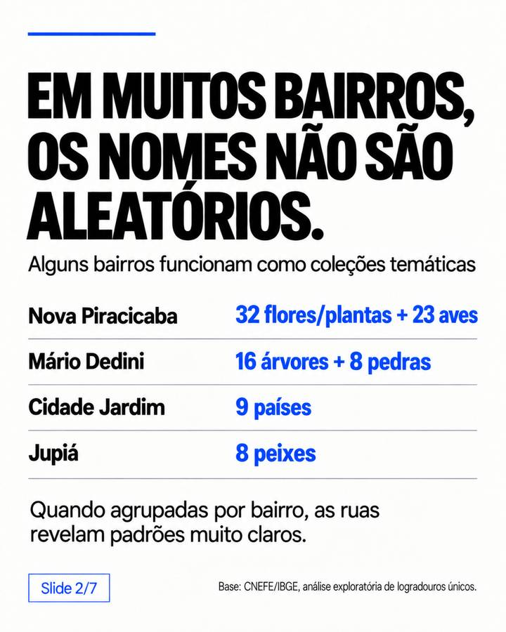
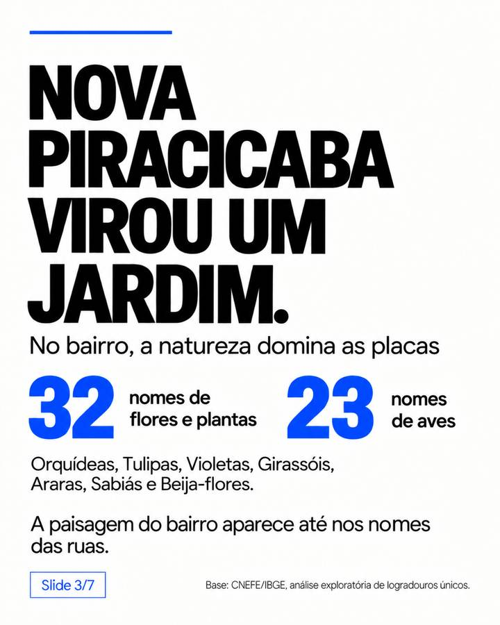
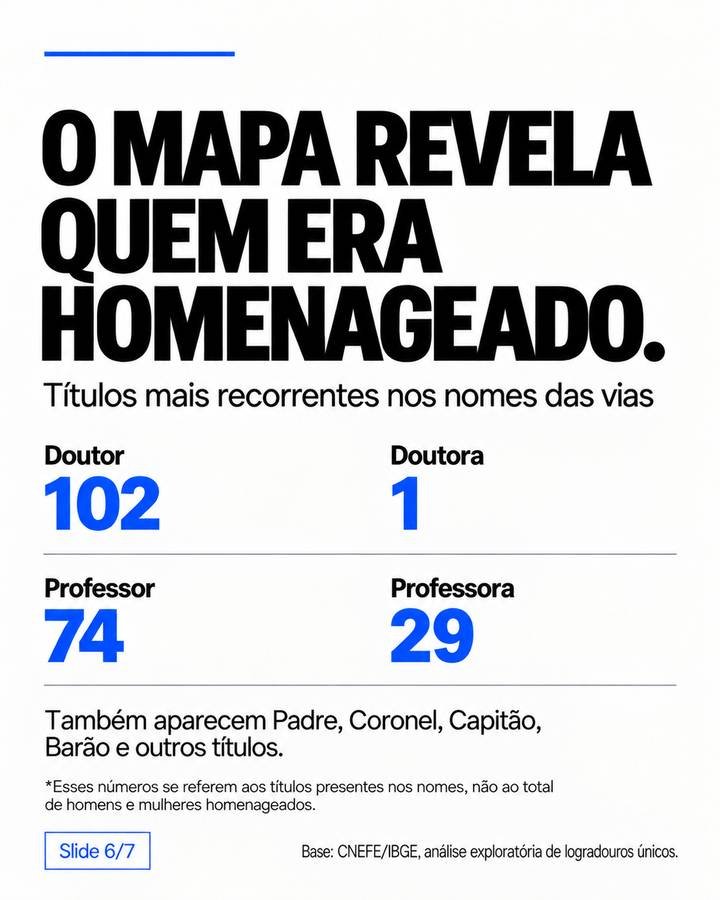

# Piracicaba Street Names


Data story sobre os nomes das ruas de Piracicaba (SP): padrões temáticos por bairro, sobrenomes recorrentes, títulos honoríficos e outras marcas de memória urbana.

## O projeto

A análise parte do **CNEFE — Cadastro Nacional de Endereços para Fins Estatísticos (Censo 2022/IBGE)**. A base municipal contém registros de endereços; para estudar a nomenclatura das vias, os registros foram reduzidos a combinações únicas de localidade, tipo, título e nome do logradouro.

O objetivo não é apenas contar ruas, mas investigar o que o mapa da cidade revela sobre as escolhas de nomeação.

## Principais achados

- Muitos bairros apresentam **coleções temáticas** de nomes de ruas.
- **Nova Piracicaba** concentra nomes de flores, plantas e aves.
- **Mário Dedini** reúne árvores e pedras/gemas.
- **Cidade Jardim** possui um conjunto marcante de países.
- **Jupiá** apresenta nomes de peixes e outras referências próprias.
- Sobrenomes como **Furlan, Trevisan, Ometto, Dedini e Pecorari** aparecem repetidamente em denominações.
- Entre os títulos explícitos, aparecem fortes assimetrias: **Doutor (102) × Doutora (1)** e **Professor (74) × Professora (29)**.
- Os títulos não equivalem ao total de homens e mulheres homenageados; são apenas uma característica textual dos nomes das vias.

## Base analisada

- **224.750** registros de endereço no arquivo municipal do CNEFE.
- **4.086** denominações únicas considerando tipo + título + nome do logradouro.
- **5.603** combinações localidade–logradouro quando o bairro/localidade é preservado.

## Carrossel

<p align="center">
  
  
  
</p>
<p align="center">
  
  
  
</p>
<p align="center">
  
</p>

## Estrutura

```
.
├── README.md
├── carousel/
│   ├── 01-cover.jpg
│   ├── 02-bairros-tematicos.jpg
│   ├── 03-nova-piracicaba.jpg
│   ├── 04-cidade-jardim.jpg
│   ├── 05-sobrenomes.jpg
│   ├── 06-titulos.jpg
│   └── 07-resumo.jpg
├── data/
│   └── insights_summary.csv
├── docs/
│   ├── insights.md
│   └── methodology.md
├── src/
│   └── build_streets.py
├── .gitignore
└── requirements.txt
```

## Reproduzir o processamento

```bash
pip install -r requirements.txt
python src/build_streets.py
```

O script baixa o arquivo oficial do IBGE e gera duas tabelas em `data/processed/`:

- `streets_unique.csv`
- `streets_by_locality.csv`

## Fonte

**IBGE — CNEFE, Censo Demográfico 2022**  
Município: Piracicaba/SP — código IBGE 3538709.

Arquivo de origem: `3538709_PIRACICABA.zip`

Fonte oficial:  
https://ftp.ibge.gov.br/Cadastro_Nacional_de_Enderecos_para_Fins_Estatisticos/Censo_Demografico_2022/Arquivos_CNEFE/CSV/Municipio/35_SP/3538709_PIRACICABA.zip

## Observações metodológicas

O CNEFE é uma base de endereços, não um cadastro histórico de homenagens. Por isso:

- a repetição de um sobrenome não prova parentesco;
- a presença de um título não determina o gênero de todos os homenageados;
- categorias temáticas foram identificadas de forma exploratória e devem ser validadas quando usadas como afirmações históricas;
- diferenças de grafia e registros de um mesmo logradouro em diferentes localidades podem exigir padronização adicional.

Veja [docs/methodology.md](docs/methodology.md) para detalhes e [docs/insights.md](docs/insights.md) para a leitura completa dos padrões.

## Autor

Projeto de **Gabriel Delvaje** para a série *Piracicaba Data Stories*.
